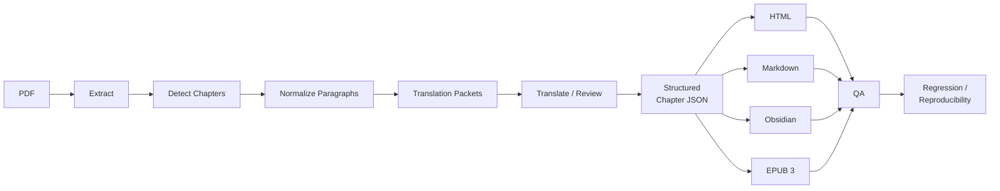

# ebook-translation-toolkit

> 结构化电子书中文版工具链 — 一份 PDF，七份交付物：结构化章节数据、完整中文译文、离线 HTML、Markdown、Obsidian 笔记，以及可重排 EPUB 3。

A structure-first PDF ebook translation pipeline for Chinese HTML, Markdown, Obsidian, and reflowable EPUB 3 output. Deterministic builds, single-source structured chapter JSON, language-aware terminology lock, project-level QA gates.

- **Homepage**: <https://github.com/conanxin/ebook-translation-toolkit>
- **Version**: 0.2.0
- **License**: MIT
- **Python**: ≥ 3.10
- **Companion example**: [`conanxin/the-cybernetic-brain-zh-example`](https://github.com/conanxin/the-cybernetic-brain-zh-example) (private — see [Case Study](docs/CASE_STUDY_THE_CYBERNETIC_BRAIN.md))

## Why

When translating a long-form academic book from English to Chinese, four structural problems keep biting:

1. **PDF page boundaries split paragraphs.** A logical paragraph that crosses a page is broken into two blocks in naïve extractors.
2. **Figures are inserted mid-paragraph**, then translated as if they were text.
3. **Footnotes jump to the end of the book** in HTML / EPUB instead of staying close to the call site.
4. **Same translator uses two names for Stuart Kauffman**, and "Gestell" is rendered as 框定 in five chapters and 座架 in one.

The toolkit solves all four by treating **structured chapter JSON** as the single source of truth, and rendering every downstream format from it.

## Capabilities

- **PDF text-layer detection** with automatic OCR fallback
- **Chapter boundary detection** from PDF structure + heading heuristics
- **Cross-page paragraph repair** — PDF page breaks stay as anchors, paragraphs stay intact
- **Image extraction** with paragraph-level anchoring
- **Translation packet generation** with preserved block_id and source context
- **Bilingual proper-noun rules** (Kauffman, Bateson, Laing, ...)
- **Project-level terminology lock** — preferred_zh / deprecated_zh / context_required
- **Footnotes** — Popover in HTML, native in Markdown, EPUB 3 `<aside>` in EPUB
- **Offline HTML** — single file, inline popovers, no visual italics, no JS
- **Portable Markdown** — standard `[^N]` footnotes
- **Obsidian sync** — name-safe notes, `[[wikilink]]` cross-references
- **EPUB 3** — reflowable, nav.xhtml + NCX, page-list, deterministic build
- **QA gates** — paragraph reflow / page anchor / image anchor / bilingual terms / terminology lock / footnote interaction
- **Reproducible builds** — UUID + dcterms:modified are persisted, ZIP entry timestamps are deterministic
- **User-level Codex Skill** + **Hermes Agent compatibility**

## Architecture



Every downstream format is rendered from the same `chapter-XX-zh.json` and validated against the same acceptance criteria.

## Quick Start

### Windows PowerShell

```powershell
git clone https://github.com/conanxin/ebook-translation-toolkit
cd ebook-translation-toolkit
pip install -e ".[test]"

& scripts/ebook-translate.ps1 init      -Pdf "D:\path\to\book.pdf" -ProjectRoot "D:\projects\<slug>"
& scripts/ebook-translate.ps1 extract   -ProjectRoot "D:\projects\<slug>"
& scripts/ebook-translate.ps1 render-html   -Chapter 1 -ProjectRoot "D:\projects\<slug>"
& scripts/ebook-translate.ps1 render-epub   -ProjectRoot "D:\projects\<slug>"
& scripts/ebook-translate.ps1 validate-epub -Epub "D:\projects\<slug>\output\epub\<slug>-zh.epub"
```

### WSL / Bash

```bash
git clone https://github.com/conanxin/ebook-translation-toolkit
cd ebook-translation-toolkit
pip install -e ".[test]"

scripts/ebook-translate.sh init      --pdf /mnt/d/path/to/book.pdf --project-root /mnt/d/projects/<slug>
scripts/ebook-translate.sh extract   --project-root /mnt/d/projects/<slug>
scripts/ebook-translate.sh render-html   --chapter 1 --project-root /mnt/d/projects/<slug>
scripts/ebook-translate.sh render-epub   --project-root /mnt/d/projects/<slug>
scripts/ebook-translate.sh validate-epub --epub /mnt/d/projects/<slug>/output/epub/<slug>-zh.epub
```

### Python (no shell wrapper)

```bash
python -m ebook_translation_toolkit --help
python -m ebook_translation_toolkit extract --project-root <ROOT>
python -m ebook_translation_toolkit render-html --chapter 1 --project-root <ROOT>
python -m ebook_translation_toolkit render-epub --project-root <ROOT>
python -m ebook_translation_toolkit validate-epub --epub <EPUB>
```

### Codex Skill (auto-discovered)

The toolkit ships a user-level Skill under `skill/ebook-translation-zh/SKILL.md`.
Install it once:

```bash
scripts/install-user-skill.sh    # WSL / Bash
# or
powershell -ExecutionPolicy Bypass -File scripts/install-user-skill.ps1
```

After that, Codex / Hermes agents that follow Skill-discovery semantics will
auto-load the canonical workflow and standards.

### Hermes Agent

Drop `ebook-translation-zh` into your local Hermes skill set:

```bash
mkdir -p ~/.hermes/skills
ln -s /mnt/d/home/conanxin/workspace/ebook-translation-toolkit/skill/ebook-translation-zh \
      ~/.hermes/skills/ebook-translation-zh
```

The Skill then loads on every relevant task and the toolkit's CLI stays
the authoritative execution path.

## Example: The Cybernetic Brain (private case study)

This toolkit was developed end-to-end on a single 537-page academic book.
Full benchmark numbers, file inventory, and the book itself live in the
private case-study repository:

- [`conanxin/the-cybernetic-brain-zh-example`](https://github.com/conanxin/the-cybernetic-brain-zh-example) — **PRIVATE**
- Companion report: [docs/CASE_STUDY_THE_CYBERNETIC_BRAIN.md](docs/CASE_STUDY_THE_CYBERNETIC_BRAIN.md)

The book itself is **not** shipped in this public toolkit — only the
project scaffolding, configuration templates, fixture samples, and metrics
under [`examples/the-cybernetic-brain/`](examples/the-cybernetic-brain/).

### Example metrics

| Metric | Value |
|---|---|
| Source PDF pages | 537 |
| Body chapters | 8 |
| English source words | 194,671 |
| Chinese characters | 321,960 |
| Body images | 85 |
| Footnotes | 412 |
| Page anchors | 334 |
| EPUB version | EPUB 3 (reflowable) |
| EPUB ZIP entries | 101 |
| EPUB size | 2,699,091 bytes |
| EPUB SHA-256 | `158049c890f713dac8197b6285382492a172196b707fbd7f61204d0293a49fe6` |
| Tests | 106 enumerated, 102 passed, 4 env-skipped, 0 failures, 0 errors |

## Quality gates

Every chapter move leaves through one of three gates; each gate returns
`PASS` / `WARN` / `FAIL`:

- **PASS**: artefact is safe to ship.
- **WARN**: known limitation; usually safe to ship but flagged in the report.
- **FAIL**: block the merge / release until fixed.

| Gate | What it checks |
|---|---|
| `check-paragraph-reflow` | no paragraph was split by an artificial PDF page boundary |
| `check-page-anchors` | every printed page has exactly one anchor |
| `check-image-anchors` | every body image sits inside its expected paragraph |
| `check-bilingual-terms` | every PERSON has its English on first occurrence |
| `check-terminology-lock` | preferred_zh is used; deprecated_zh is gone; context_required gates are respected |
| `check-footnotes` | every noteref has a backing aside; every aside has a backlink; no stranded markers |
| `check-html-render` | no visible italics, no JS, no horizontal overflow at 1366×768 or 390×844 |
| `check-obsidian-sync` | chapter Markdown SHA matches Obsidian copy |
| `validate-epub` | mimetype first, OPF / NCX / nav / page-list / manifest / spine / images / footnotes / internal links |

## Repository layout

```text
ebook-translation-toolkit/
├── README.md
├── QUICK_START.md
├── CHANGELOG.md
├── VERSION
├── LICENSE                 (MIT)
├── AGENTS.md
├── pyproject.toml
├── requirements.txt
├── src/
│   └── ebook_translation_toolkit/
│       ├── cli.py
│       ├── epub_models.py
│       ├── epub_notes.py
│       ├── epub_navigation.py
│       ├── epub_package.py
│       ├── epub_validator.py
│       ├── legacy_chapter_adapter.py
│       ├── render_epub.py
│       ├── render_epub_book.py
│       ├── ...
├── scripts/                 (bash + PowerShell wrappers, SKILL installers)
├── skill/ebook-translation-zh/  (user-level Skill)
├── standards/               (12 markdown standards — QA + rendering + translation)
├── templates/               (epub/, html/, markdown/, project/)
├── schemas/                 (structured-chapter schema + examples)
├── tests/                   (unittest, 106 tests)
├── examples/the-cybernetic-brain/  (project scaffolding only)
├── docs/                    (workflow, architecture, history, case study, ...)
├── reports/                 (development + publication reports)
└── .github/workflows/       (test.yml, package.yml)
```

## Adding a new book

1. `scripts/ebook-translate.sh init --pdf <PDF> --project-root <NEW>` (or
   the PowerShell equivalent).  This scaffolds `.ebook-translation/`,
   `source/`, `intermediate/`, `output/`, and `assets/`.
2. Edit `.ebook-translation/project.yaml` (book title, author, language,
   glossary, terminology lock, EPUB settings).
3. Run `extract`, `detect`, `normalize`, `prepare`.  Inspect every
   intermediate JSON.
4. Translate via your preferred agent (Codex, Hermes, human, ...) using
   `Translation Packets` produced by the toolkit.  Each packet preserves
   source block_id + source text + page anchors.
5. Write structured translations back into `intermediate/chapters/chapter-XX-zh.json`.
6. `render-html`, `render-markdown`, `sync` (Obsidian), `render-epub`,
   `validate-epub`.  All five read from the **same** `chapter-XX-zh.json`.

The complete walkthrough lives in [docs/WORKFLOW.md](docs/WORKFLOW.md).

## Documentation

| Document | Purpose |
|---|---|
| [docs/INDEX.md](docs/INDEX.md) | master index of every doc |
| [docs/WORKFLOW.md](docs/WORKFLOW.md) | end-to-end workflow reference |
| [docs/ARCHITECTURE.md](docs/ARCHITECTURE.md) | layered view + module map |
| [docs/DATA_MODEL.md](docs/DATA_MODEL.md) | structured-chapter schema |
| [docs/TRANSLATION_PIPELINE.md](docs/TRANSLATION_PIPELINE.md) | extract → translate → write back |
| [docs/HTML_AND_OBSIDIAN.md](docs/HTML_AND_OBSIDIAN.md) | rendering contract for HTML & Obsidian |
| [docs/EPUB_PIPELINE.md](docs/EPUB_PIPELINE.md) | EPUB 3 packaging & determinism |
| [docs/QUALITY_GATES.md](docs/QUALITY_GATES.md) | every QA gate explained |
| [docs/TROUBLESHOOTING.md](docs/TROUBLESHOOTING.md) | symptom → fix cookbook |
| [docs/CASE_STUDY_THE_CYBERNETIC_BRAIN.md](docs/CASE_STUDY_THE_CYBERNETIC_BRAIN.md) | long-form case study |
| [docs/DEVELOPMENT_HISTORY.md](docs/DEVELOPMENT_HISTORY.md) | 28-stage build log |
| [docs/ROADMAP.md](docs/ROADMAP.md) | what's next |

## Current version

`0.2.0` — EPUB 3 packaging, terminology lock QA, Chapter 1 legacy Markdown
adapter, deterministic builds.  See [CHANGELOG.md](CHANGELOG.md).

## Testing

```bash
python -m unittest discover -s tests -p "test_*.py" -v
```

Expected on a clean checkout:

```text
Ran 106 tests in <N> s
OK (skipped=4)
```

The 4 skipped tests are environmental (PDF fixture + Playwright + a
permission-guarded filesystem test).  They are not failures.

## Contributing

Issues and PRs welcome.  Read [AGENTS.md](AGENTS.md) first — it documents
the change discipline this codebase enforces, including:

- never ship a book change as a code change
- reusable rules live in `standards/` and `tests/`
- a single source of truth (the structured chapter JSON) means every new
  format must read from it, never bypass it

## Release verification

The latest release is `v0.2.0`.  See
[GitHub Releases](https://github.com/conanxin/ebook-translation-toolkit/releases)
for wheel + sdist assets and changelog.

Known environmental limits (not blockers):

- **EPUBCheck** (Java jar) is not bundled; install separately for external validation.
- **Calibre** (`ebook-meta`, `ebook-convert`) is not installed by default.
- **Third-party EPUB readers** (Apple Books, Calibre Viewer, Thorium, ...) are not exercised by CI; the toolkit's internal validator + a headless Chromium probe cover rendering correctness structurally.
