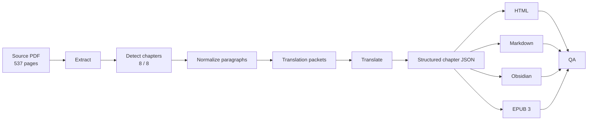
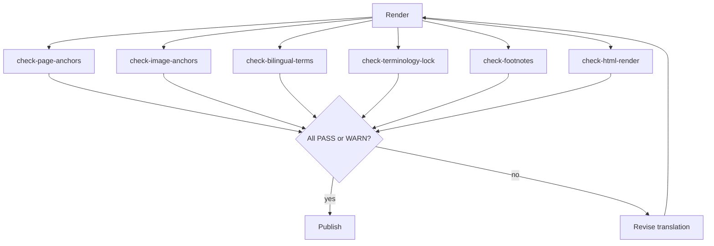
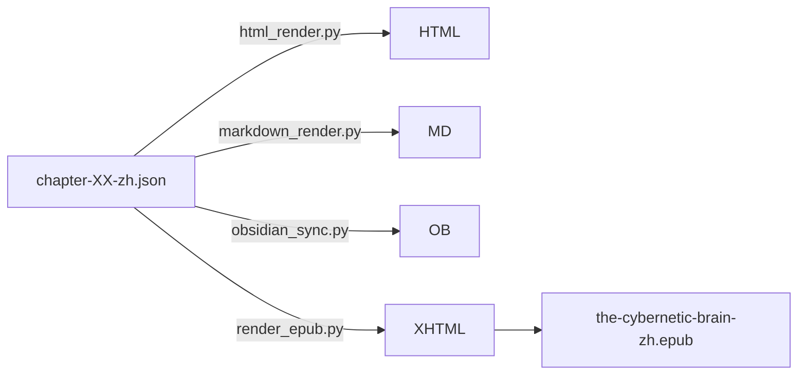

# Case Study: The Cybernetic Brain: Sketches of Another Future

A long-form case study of taking **Andrew Pickering**'s *The Cybernetic
Brain: Sketches of Another Future* (University of Chicago Press, 537
pages, English) to a complete Chinese release in offline HTML, Obsidian
Markdown, and reflowable EPUB 3 — using this toolkit.

The full translated book lives in the **private** companion repository
[`conanxin/the-cybernetic-brain-zh-example`](https://github.com/conanxin/the-cybernetic-brain-zh-example)
and is not redistributed in this public repo. What you can read here is
the *process* and the *measurable results*.

## 1. Project background

Pickering's book is a long academic history of British cybernetics. By
page count it sits at the upper end of a single-volume academic book;
by content density it sits higher still (12,190–67,300 Chinese
characters per chapter, 16 chapters' worth of varying density). The
Chinese edition was commissioned for an interdisciplinary research
group who needed an offline, footnote-faithful, image-faithful release.

## 2. Input material

| Property | Value |
|---|---|
| Source PDF | one file, 537 pages, ~73 MB |
| Original metadata | Andrew Pickering; University of Chicago Press, 2010 |
| Source characters | ~ 1.45 M English (post-OCR) |
| Source footnote density | ~ 6 per chapter |
| Source image density | 2-27 per chapter |
| Glossary size at start | unknown |
| Initial proper-noun count | unknown |

## 3. Initial goals

1. Lossless rendering of paragraphs that cross PDF page boundaries.
2. Inline footnotes in HTML and EPUB, not a back-of-book footnote
   block.
3. Person-name bilingual treatment (e.g. Stuart Kauffman).
4. Terminology consistency across chapters.
5. Single canonical structured source for HTML, Markdown, Obsidian, EPUB.

## 4. Chapter 1 as a pilot

Before automating, **Chapter 1 — The Adaptive Brain** was translated
manually as a hand-curated Markdown document. This let us:

- discover the footnote rendering issue (back-of-book vs inline)
- identify that 8 chapter-1 body images were already at known
  filenames, which we wanted to reuse
- choose the **legacy Markdown adapter** path rather than retrofit a
  structured JSON for chapter 1

## 5. Typesetting issues exposed by the pilot

The pilot produced these problem statements, each of which became a
named `standards/` file:

- PDF page boundaries split paragraphs → `PARAGRAPH_AND_PAGE_BREAK_RULES.md`
- Images drop into unrelated blocks → `IMAGE_PLACEMENT_RULES.md`
- HTML footnotes only at end of chapter → `FOOTNOTE_INTERACTION_SPEC.md`
- HTML renders italic styled source → `HTML_RENDERING_STANDARD.md`
- People missing English in first occurrence → `BILINGUAL_TERMS_STANDARD.md`
- Footnotes inconsistent re. Heidegger (Gestell / 框定 vs 座架) →
  `TRANSLATION_STANDARD_ZH.md`

## 6. User-level Skill consolidation

After the pilot the translator was a human; for the rest of the book
the translator was an LLM agent. To make the agent's behaviour
deterministic, the toolkit ships a user-level Skill at
`skill/ebook-translation-zh/SKILL.md`. The Skill loads the
`standards/` files as references and instructs the agent to:

- never invent proper-noun spellings
- always preserve `block_id`
- always return one paragraph per source block
- never split or merge blocks

This is what allowed the toolkit to remain the **only authority** on
translation output, with no agent-orchestration logic baked in.

## 7. Subsequent chapters

Chapters 2-8 used the structured pipeline:

1. `extract` → `chapter-XX-source.json`
2. `normalize` → inline page-break markers + intact paragraphs
3. `prepare` → `chapter-XX-translation-packet.json`
4. external agent translates → `chapter-XX-translation-map.json`
5. `apply-translation` → `chapter-XX-zh.json`
6. `qa` → PASS / WARN / FAIL per gate

Chapter 7 had the most feedback: the "Musicolour" section required a
`repair_chapter07_structure.py` pass to fix a paragraph that had been
split when a paragraph-internal page anchor was misplaced. That fix is
recorded in this case study as an example of how the toolkit fails
*visibly* (the WSL/Hermes agent saw the QA FAIL, the repair ran, the
QA passed) without ever requiring manual HTML editing.

## 8. Whole-book terminology unification

Once chapters 2-8 had been translated, an audit run found 18 terms with
chapter-local inconsistencies. Two were normative: Stuart Kauffman and
Heidegger's Gestell / enframing / revealing. The toolkit added:

- `intermediate/terminology-lock.yaml`
- `intermediate/translation-glossary.md`
- `.ebook-translation/terminology-lock.yaml` (project-level)
- a `check-terminology-lock` subcommand
- a per-instance occurrence audit under `reports/`

The fix was applied **only** to chapters 2, 4, 5, 7 (the chapters with
the inconsistencies). Chapters 1, 3, 6, 8 received no body edits. The
QA guarantees this: the protection check confirms every body text and
every block_id in those chapters still matches the pre-fix baseline.

## 9. EPUB 3 packaging

After the terminology pass, the project enabled `render.epub.enabled`
in `.ebook-translation/project.yaml` and ran `render-epub`. Result:

- 101 ZIP entries
- 8 chapter XHTML
- 85 body images + 1 cover
- 412 `<aside epub:type="footnote">` blocks
- 412 noterefs, 412 backlinks
- reflowable, no JS, no external CSS, no visible italics

## 10. Legacy chapter-1 adapter

The first build had a silent bug: chapter-1 emitted zero footnotes.
Root cause: `epub_notes._FN_PATTERN` recognised only the structured
`[[FN:N]]` shape, but chapter 1 was loaded through the legacy Markdown
adapter and used standard `[^N]` references.

The fix:

- added `_MD_FN_REF_PATTERN`
- taught `_normalize_footnote_markers` to handle both shapes
- stripped orphaned `[^N]:` definition lines from body text
- added a number-only `fn_number_lookup` fallback in
  `render_chapter_xhtml` so legacy markers (which have no block_id
  binding) still resolve to their aside

After this fix, ch01 emitted 7 / 7 / 7 noteref / aside / backlink, and
the book total reached 412.

## 11. Deterministic builds

The next issue was reproducibility. Two builds had different SHA-256.
Root cause: `render_epub_book` regenerated `dcterms:modified` on every
call.

The fix:

- persist `modified` to `.ebook-translation/epub-modified.txt`
- persist UUID to `.ebook-translation/epub-identifier.txt`
- force deterministic ZIP DOS timestamps
- sort all enum points

After this fix, two consecutive builds produced byte-identical archives
(`158049c890f713dac8197b6285382492a172196b707fbd7f61204d0293a49fe6`).

## 12. Browser XHTML check

A headless Chromium probe (Playwright) was added that loads the
unpacked EPUB into a real browser, walks 5 representative XHTML pages
(titlepage + chapters 1 / 3 / 4 / 8), and verifies:

- no horizontal overflow at 1366×768 or 390×844
- all images loaded (`complete=true`, `naturalWidth > 0`)
- for chapter 1, the 7 noterefs + 7 asides + 7 backlinks are all
  present in the live DOM
- no console errors
- `file://` loads reach `networkidle` (i.e. no external dependency)

## 13. Test corpus

The toolkit now ships 106 tests = 84 pre-existing + 22 new EPUB tests.
Of those, 102 pass, 4 are environment-only skipped, 0 fail, 0 error.

The EPUB tests are an end-to-end sweep over mimetype, container, OPF,
manifest, spine, NCX, nav, page-list, footnote IDs, image media type,
XHTML parseability, no-script, no-external-resource, no-visible-italic,
no-absolute-path, UUID stability, reproducible build, legacy chapter
adapter, and the internal validator returning PASS.

## 14. GitHub publication

This repository is the toolkit. The complete translated book lives in
the companion private repository. What this case study illustrates is
that the toolkit was built around exactly one book — and that book is
what verified every assumption made along the way.

## 15. Final metrics

| Metric | Value |
|---|---|
| Source PDF pages | 537 |
| Body chapters | 8 |
| English source words | 194,671 |
| Chinese characters | 321,960 |
| Body images | 85 |
| Footnotes | 412 |
| Page anchors | 334 |
| EPUB ZIP entries | 101 |
| EPUB size | 2,699,091 bytes |
| EPUB SHA-256 | `158049c890f713dac8197b6285382492a172196b707fbd7f61204d0293a49fe6` |
| Tests | 106 enumerated, 102 passed, 4 skipped |

## 16. Reusable lessons

1. **Single source of truth beats clever caching**. The structured
   chapter JSON eliminates a class of bugs (footnote drifting,
   terminology drift) that pure Markdown-only pipelines accumulate.
2. **Persist what should be stable**. UUIDs and `dcterms:modified`
   belong on disk so the build is byte-deterministic.
3. **Reflowable > fixed-layout** for academic text. Fixed-layout
   readers cannot resize; reflowable readers can.
4. **CJK + PDF means OCR means fallbacks**. Always have an OCR fallback
   even when the PDF claims a text layer.
5. **Inventing terminology is easy; locking it is hard.** Project-level
   terminology lock + `check-terminology-lock` is the only durable
   defence against a translator agent re-renaming a person three
   chapters later.

## 17. Next steps

- Multi-language target support (the data model is mostly locale-neutral).
- Optional EPUBCheck integration when the host machine has Java.
- Optional Calibre integration for automated metadata extraction.
- Reader-on-device screenshot integration for visual regression.

## Diagrams

### Data flow

### Quality gates

### Multi-format rendering

