# Translation Pipeline

How the toolkit gets from PDF source text to a canonical
`chapter-XX-zh.json` without losing structure.

## Stages

```mermaid
flowchart LR
  P[source.pdf] --> E[extract] --> J[ebook-pages.jsonl]
  J --> D[detect] --> C[chapters/*.json]
  C --> N[normalize] --> S[chapter-XX-source.json]
  S --> Pk[prepare] --> Pt[chapter-XX-translation-packet.json]
  Pt --> T[translate<br/>external agent] --> M[chapter-XX-translation-map.json]
  M --> A[apply-translation] --> Z[chapter-XX-zh.json]
  Z --> QA[check-*]
```

## What `prepare` ships to the translator

For each block in `chapter-XX-source.json`:

- `block_id`
- full source text (with PDF page-break markers preserved)
- the segment's glossary slice
- chapter-level proper-noun list
- any term that has a `context_required` lock; the lock hint is included verbatim

The translator (whether a human or an LLM agent) is expected to return
**one translated paragraph per block** with the same `block_id` order.
No merging or splitting is allowed.

## Why packet-based?

So that the translator can:

- work offline on a single chapter
- iterate per block without rolling back other chapters
- resume an interrupted session via `progress` / `book_progress.py`

The toolkit never stores partial translations in the packet JSON; the
packet is a **read-only** input contract.

## Why `chapter-XX-zh.json` is canonical

- Renderer (HTML, Markdown, Obsidian, EPUB) all read from it.
- QA tooling reads from it.
- Obsidian sync writes *to* the Obsidian vault; the source-of-truth on
  disk is `output/markdown/chapter-XX-zh.md`, copied verbatim from the
  JSON rendering.
- The translator may **never** edit the JSON directly. They go through
  `apply-translation --chapter N --translations <map>`.

## Translating tools

The toolkit ships a user-level Skill (`skill/ebook-translation-zh/`)
that loads in Codex / Hermes / Claude Code. It gives the agent:

- the canonical block protocol
- the bilingual proper-noun table for this book
- the terminology lock rules for this book
- the standards documents from `standards/`

Without the Skill, a generic agent may still translate, but it will
not preserve `block_id` order or honour the term locks.

## Review loop

When a QA gate returns `WARN` or `FAIL`:

1. The runner prints a hint pointing at the offending block.
2. The translator re-reads the source block + the previous translation.
3. The translator emits an updated translation map.
4. `apply-translation` is re-run.
5. QA gates are re-run.

This is a state machine, not a chat. The agent never edits the
`chapter-XX-zh.json` in place.
