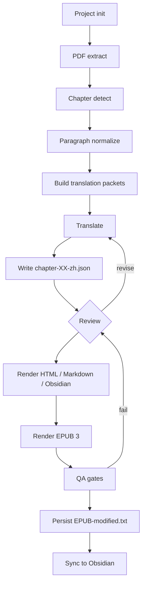
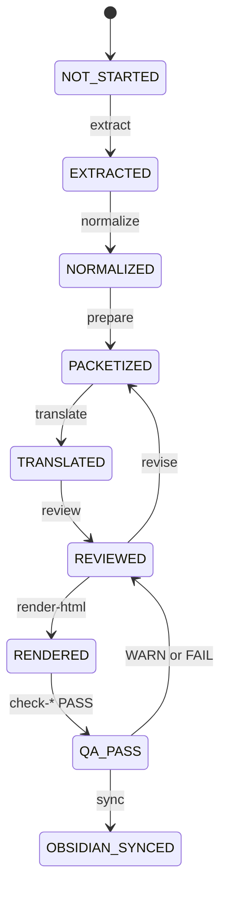

# Workflow

End-to-end workflow for taking a foreign-language PDF ebook to a
complete Chinese release.

## Phases



## Per-chapter state machine



## Phase details

### P0 — Project init

`ebook-translate init --pdf <PDF> --project-root <ROOT>` creates:

```text
<ROOT>/
├── source/                (PDF lives here, NEVER committed)
├── intermediate/
│   ├── ebook-pages.jsonl
│   ├── chapters/
│   └── translation-glossary.md
├── output/
│   ├── html/
│   ├── markdown/
│   └── epub/
├── assets/
├── reports/
├── .ebook-translation/
│   ├── project.yaml
│   ├── terminology-lock.yaml
│   ├── epub-identifier.txt
│   └── epub-modified.txt
└── scripts/verify-example.py
```

### P1 — PDF extract

`ebook-translate extract` runs PyMuPDF with text-layer detection. When
the text layer is absent it dispatches to PaddleOCR. Result is
`intermediate/ebook-pages.jsonl`.

### P2 — Chapter detect

`ebook-translate detect` looks for section headers, the table of contents,
and printing-layout cues. 8/8 chapters correctly detected for the case
study book.

### P3 — Paragraph normalize

`ebook-translate normalize` rebuilds logical paragraphs across PDF page
boundaries. Page anchors are preserved as `<span epub:type="pagebreak">`
markers in the inline text. No logical paragraph is split.

### P4 — Build translation packets

`ebook-translate prepare` packs each `chapter-XX-source.json` plus its
glossary slice and terminology hints into a `chapter-XX-translation-packet.json`.

### P5 — Translate

External agent (or human) reads the packet and produces
`chapter-XX-translation-map.json` containing one translated paragraph per
source block.

### P6 — Apply translation

`ebook-translate apply-translation --chapter N` promotes the translation map
into `chapter-XX-zh.json`, the canonical structured chapter file.

### P7 — Review

Per-block review by the same external agent, with QA hint output. May
re-enter P5.

### P8 — Render

`render-html`, `render-markdown`, `sync` each read `chapter-XX-zh.json`
only. Single source of truth.

### P9 — EPUB 3

`render-epub` reads every structured chapter, walks chapter-1 through the
legacy Markdown adapter when needed, applies the project's terminology
lock, and writes a byte-deterministic EPUB.

### P10 — QA gates

`check-paragraph-reflow`, `check-page-anchors`, `check-image-anchors`,
`check-bilingual-terms`, `check-terminology-lock`, `check-footnotes`,
`check-html-render`, `check-obsidian-sync`, `validate-epub`. Each returns
PASS / WARN / FAIL.

### P11 — Persist `epub-modified.txt`

Final EPUB's `dcterms:modified` is persisted so the next build is
byte-identical (modulo the same inputs).

### P12 — Obsidian sync

`sync --chapter N` overwrites the matching Markdown in the Obsidian
vault and copies matching `assets/chapter-NN` images.

## Idempotency

The full workflow is re-runnable. Re-running `extract` reuses cached
text layers. Re-running `render-epub` does **not** regenerate a fresh
UUID or timestamp; they are persisted.
