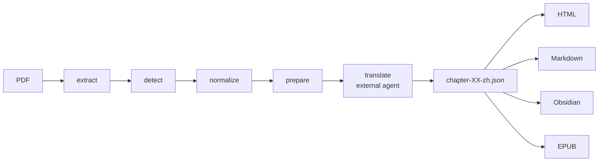

# Short case study — The Cybernetic Brain

Companion to [`docs/CASE_STUDY_THE_CYBERNETIC_BRAIN.md`](../../docs/CASE_STUDY_THE_CYBERNETIC_BRAIN.md).

A 537-page academic book, taken from English source PDF to a complete
offline HTML / Markdown / Obsidian / reflowable EPUB 3 Chinese edition
using `ebook-translation-toolkit`.

## Inputs

- 1 PDF, 537 pages, English
- 8 chapters
- 85 body images
- 412 footnotes

## Output

| Format | Where |
|---|---|
| Offline HTML | `output/html/index.html` + 8 chapter pages |
| Markdown | `output/markdown/*.md` |
| Obsidian | `_Agent/Outputs/Book-Translations/the-cybernetic-brain/*.md` |
| EPUB 3 | `output/epub/the-cybernetic-brain-zh.epub` |

## Pipeline at a glance

## Five things that bit during the case study

1. **PDF page boundaries split paragraphs** — fixed by per-block
   `page_anchor` + cross-page continuation repair.
2. **HTML footnote could only be seen at end of chapter** — fixed by
   inline `<aside epub:type="footnote">` next to the referencing block.
3. **Stuart Kauffman had two Chinese names across the book** — fixed
   by project-level terminology lock YAML.
4. **Chapter 1 footnote markers were silently dropped by the EPUB
   renderer** — fixed by adding `[^N]` recognition next to `[[FN:N]]`.
5. **dcterms:modified caused the EPUB hash to change on every build**
   — fixed by persisting the timestamp to `epub-modified.txt`.

The full process and all 28 stages are recorded in
[`DEVELOPMENT_HISTORY.md`](../../docs/DEVELOPMENT_HISTORY.md).

## Final numbers

| Metric | Value |
|---|---|
| PDF pages | 537 |
| Chapters | 8 |
| English source words | 194,671 |
| Chinese characters | 321,960 |
| Body images | 85 |
| Footnotes | 412 |
| Page anchors | 334 |
| EPUB ZIP entries | 101 |
| EPUB SHA-256 | `158049c890f713dac8197b6285382492a172196b707fbd7f61204d0293a49fe6` |
| Tests | 106 enumerated, 102 passed, 4 environment-only skipped |

See `metrics.json` for the machine-readable form.
